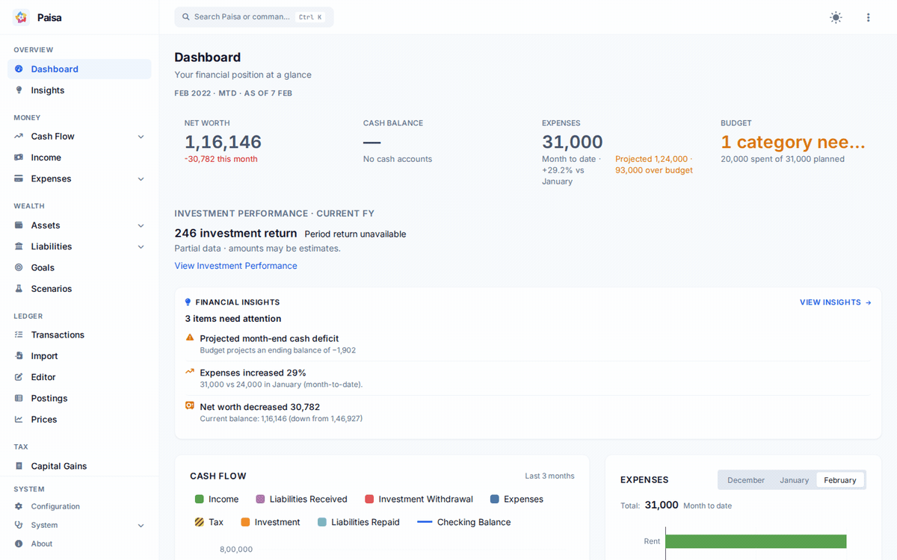

---
hide:
  - toc
---

# Paisa

Personal finance, grounded in a journal you own.

Paisa is an open-source personal finance manager built on Ledger double-entry accounting. It brings your spending, investments, liabilities, and plans into one view, with plain-text records under your control.

[Install Paisa](getting-started/installation.md){ .md-button .md-button--primary }
[Take the Product Tour](product-tour.md){ .md-button }
[Try the upstream demo](https://demo.paisa.fyi){ .md-button }

This documentation describes the current repository. The upstream demo and [upstream hosted documentation](https://paisa.fyi) may represent a different revision, as may downloadable releases.

[View the static dashboard screenshot](images/showcase/dashboard.png). The sample journal also demonstrates data-quality and budget warnings.

## Is Paisa for me?

Paisa is useful if you want to understand both everyday spending and long-term holdings, and are willing to maintain a journal or import statements. Accounts and postings take a little learning; the editor, templates, and visual reports help you work with them.

## Why plain-text accounting?

A Ledger journal records both sides of a transaction. Your accounts describe what you own and owe, and how income and expenses change those balances. The journal and configuration are readable files you can back up, version, and use independently of Paisa.

Your journal stays with the instance you control. Optional price providers contact external services; running on someone else's server gives that host access to your data. Read the [manifesto](manifesto.md) for the project's philosophy and [authentication](reference/user-authentication.md) for hosting considerations.

## Explore your finances

- **Track and understand:** expenses, income, net worth, cash flow, investment performance, and allocation.
- **Plan:** budgets, savings goals, retirement, recurring bills, and illustrative what-if scenarios.
- **Bring in your records:** CSV, Excel, and PDF imports, reusable templates, and a journal editor.
- **Check and calculate:** Doctor diagnostics and interactive sheets using journal data.

The [Product Tour](product-tour.md) explains these workflows and links to detailed references.

## Start with a working journal

1. [Install Paisa](getting-started/installation.md) using Desktop, CLI, Docker, or Nix.
2. [Follow the tutorial](getting-started/tutorial.md) to get your first instance working.
3. Explore [journal examples](getting-started/journal-examples.md), then [import your statements](reference/import.md).

Find answers in the [FAQ](faq.md), or explore [development and testing](development/testing.md) to contribute.

## Project history

Paisa was originally created by **[Anantha Kumaran](https://github.com/ananthakumaran)** and developed with contributions from the open-source community. This repository continues that work with maintenance, improvements, and new functionality while preserving the project's philosophy.

See the [original project](https://github.com/ananthakumaran/paisa), [Git history](https://github.com/Pratap-kute/paisa/commits/master/), and [upstream](https://github.com/ananthakumaran/paisa/graphs/contributors) and [current contributors](https://github.com/Pratap-kute/paisa/graphs/contributors). Paisa remains licensed under the GNU AGPL version 3 or later.
