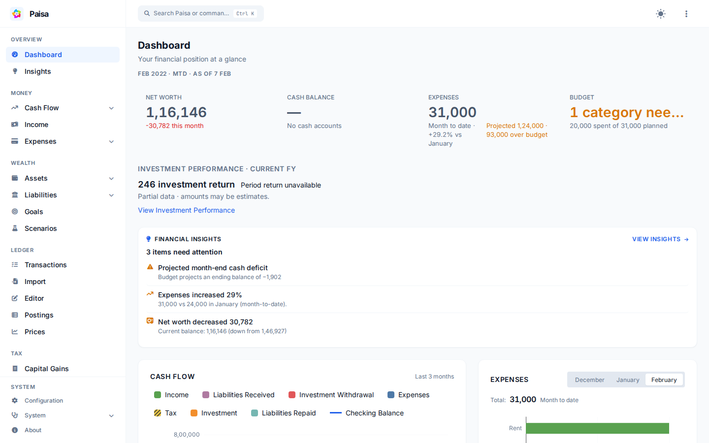
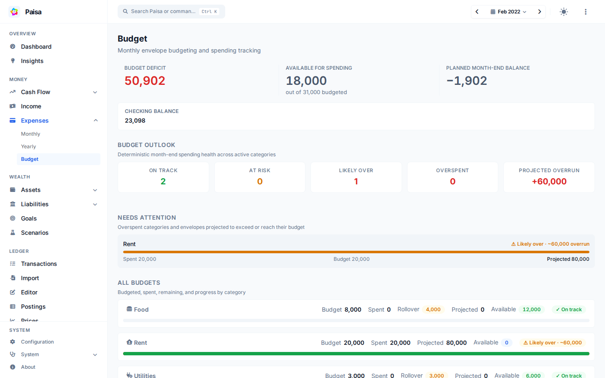
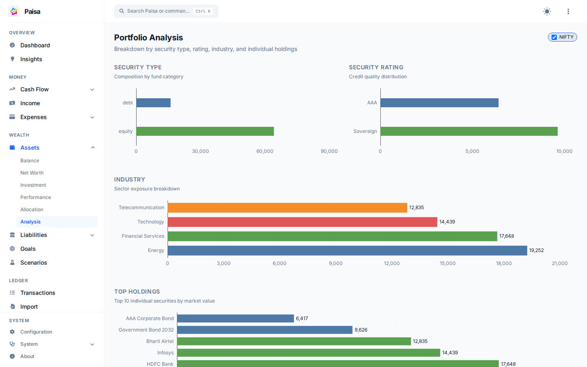
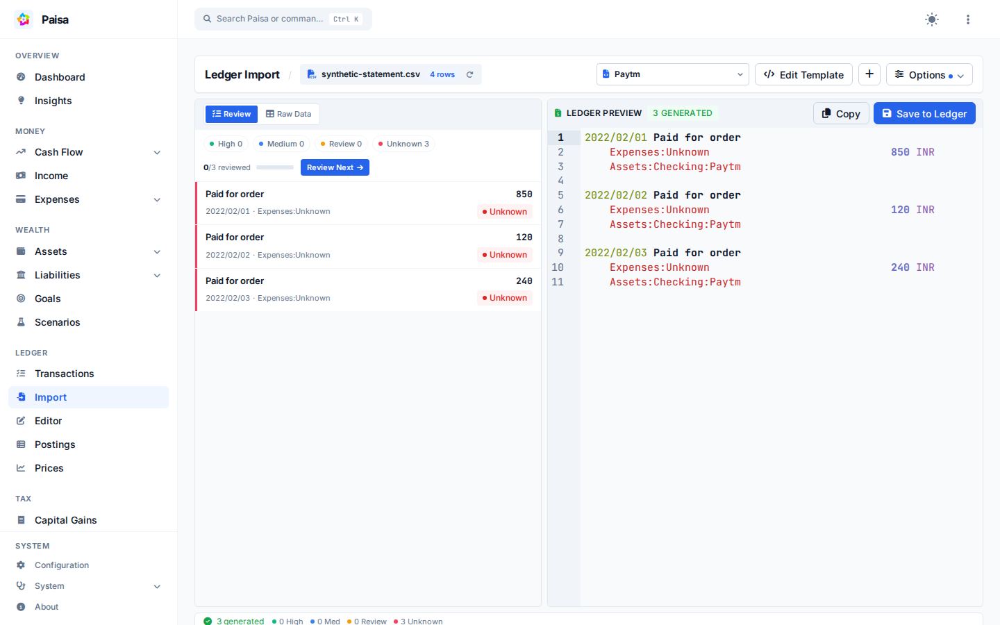
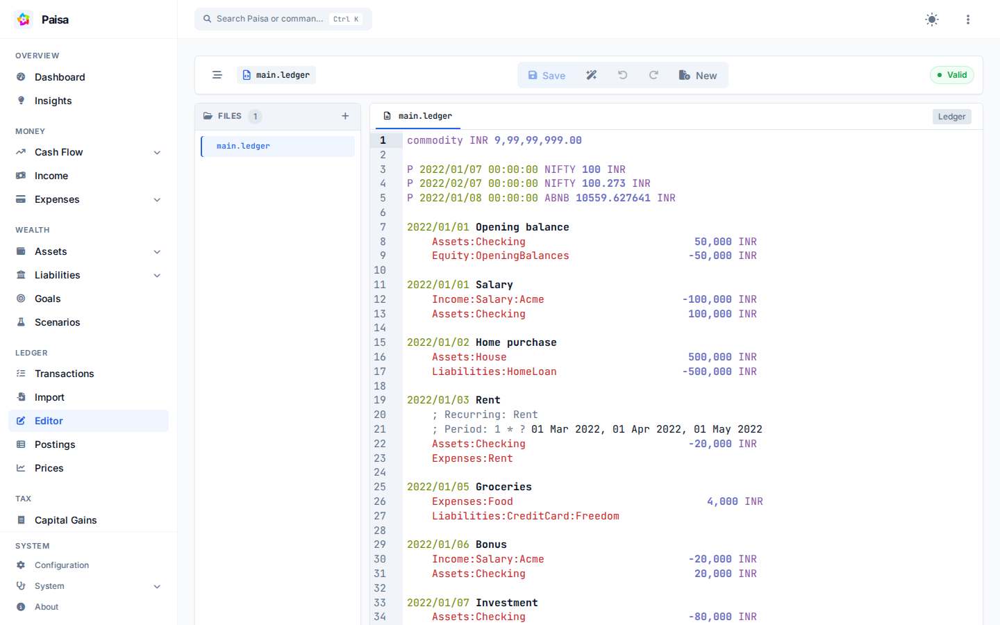
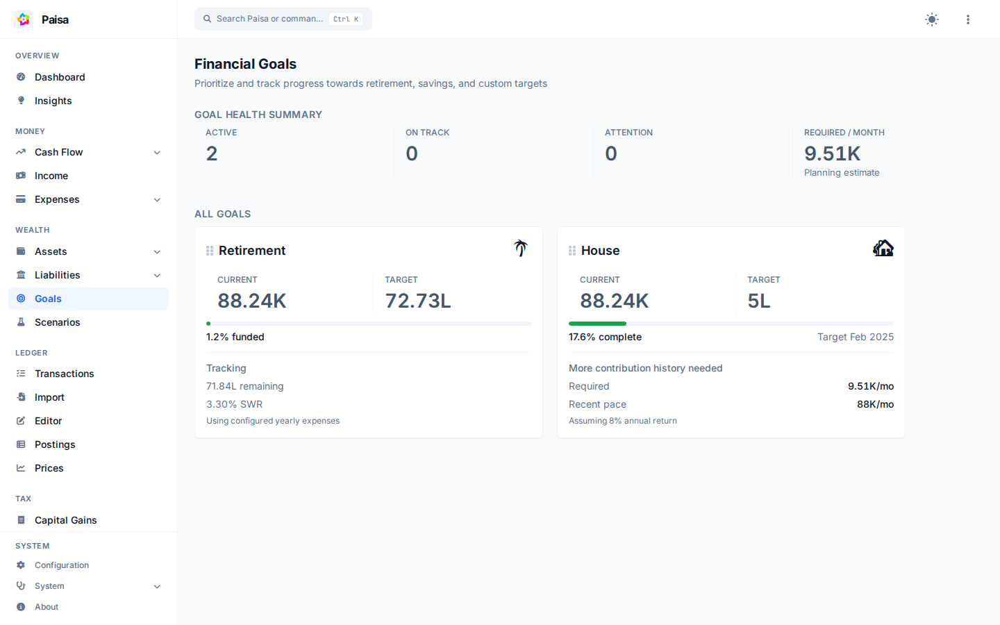

# Product Tour

Start with your financial picture, then explore the records and plans behind it. These capabilities describe this repository’s audited implementation; upstream demos and packaged releases may differ. All showcase images use synthetic data in this checkout running locally.

## Dashboard

This sample journal also demonstrates missing cash-summary data and partial investment valuations; those messages remain visible. See your financial position and recent activity together. Follow net worth, income, and expenses, then open a detailed report to understand the accounts behind a total.

[Accounts](reference/accounts.md) · [Analysis](reference/analysis.md)

## Expenses and budgets

Group spending using your account hierarchy and compare it with category budgets. Review actual spending and available amounts before deciding where to adjust your plan.

[Budgets](reference/budget.md) · [Accounts](reference/accounts.md)

## Assets and investments

Inspect holdings, allocation, and investment returns. The current implementation separates contributions from investment return and reports XIRR when sufficient data is available; valuation quality and missing data matter when interpreting results.

[Investment performance](reference/investment-performance.md) · [Allocation targets](reference/allocation-targets.md) · [Commodities and prices](reference/commodities.md)

## Cash flow and financial analysis

Explore monthly and yearly cash flow and an income statement to understand how earnings turn into spending and savings. Interactive sheets let you calculate with values from your journal.

[Analysis](reference/analysis.md) · [Sheets](reference/sheets.md)

## Import bank and card statements

Load a CSV, Excel, or PDF statement, choose or adapt an import template, and review the generated journal. In this sample, unknown categories are explicitly marked for review before saving. Templates map statement fields to Ledger entries; support for a file format does not mean every bank layout works without configuration.

[Import templates and review](reference/import.md)

## Ledger editor

Plain text remains the source of truth, with syntax highlighting, completion, validation, and formatting to support editing. Review your entries before saving and keep your journal in your own backup or version-control workflow.

[Editor](reference/editor.md) · [Journal](reference/journal.md)

## Goals and planning

Track progress toward a savings target and explore retirement assumptions. What-if Scenarios compares cash, investments, and net worth under selected income, expense, transfer, and return assumptions; it is an illustrative projection, not a market prediction.

[Goals](reference/goals/index.md) · [Retirement](reference/goals/retirement.md) · [Scenario planning](reference/scenario-planning.md)

## Recurring transactions and credit cards

Review scheduled recurring transactions and upcoming credit-card bills. Configure recurrence and card statement dates to organize what is due; these views do not connect to your bank or initiate payments.

[Recurring transactions](reference/recurring.md) · [Credit cards](reference/credit-cards.md)

## Check financial data with Doctor

Open More → Doctor to inspect accounting, valuation, allocation, and reconciliation findings. Review the affected records using the provided links; diagnostics do not automatically alter your journal.

[Doctor](reference/doctor.md)

## Privacy and data ownership

Run Paisa locally or on a server you control. Journals and configuration remain readable files, while Paisa maintains a local database for its reports. External price services and third-party hosts have their own data boundaries.

[Journal](reference/journal.md) · [Configuration](reference/config.md) · [Authentication](reference/user-authentication.md) · [Manifesto](manifesto.md)

