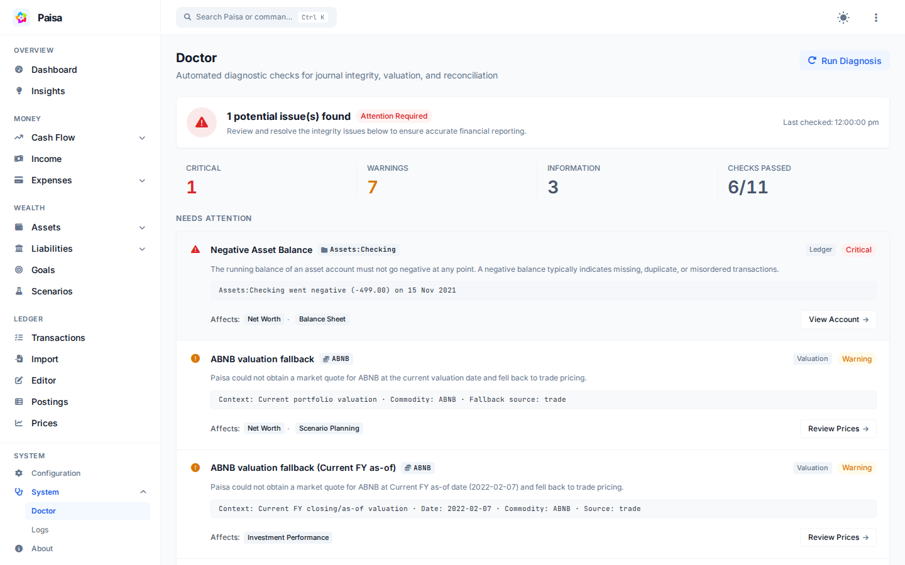

# Doctor

Open **More → Doctor** to find journal and valuation problems that affect Paisa's
reports. It checks posting directions, prices, allocation configuration,
investment reconciliation, and whether Scenario Planning has enough history.

Doctor is read-only. It links to records that need attention but never changes
the journal or creates balancing entries.

For example, Doctor may report that the latest price for `NIFTY` is 12 days
old. The finding explains that portfolio and net-worth values may be stale and
links you to the prices that need attention.

## Checks

Doctor runs these checks:

| Check | Category | Code | Severity when Found |
| :--- | :--- | :--- | :--- |
| **Asset balance integrity** | Ledger | `negative_asset_balance` | Danger |
| **Posting direction** | Ledger | `invalid_income_direction`, `invalid_expense_direction` | Danger |
| **Exchange-price coverage** | Valuation | `missing_exchange_price` | Danger |
| **Journal-price consistency** | Valuation | `journal_price_mismatch` | Warning |
| **Allocation configuration** | Allocation | `allocation_target_missing_account` | Warning |
| **Current valuation quality** | Valuation | `valuation_fallback` | Warning |
| **Current FY valuation quality** | Valuation | `valuation_fallback` | Warning |
| **Investment attribution** | Investments | `unattributed_investment_income` | Warning |
| **Current FY reconciliation** | Investments | `investment_performance_reconciliation_failed` | Danger |
| **Scenario history readiness** | History | `insufficient_income_history`, `insufficient_expense_history`, `insufficient_contribution_history`, `no_investment_activity` | Info / Warning |
| **Scenario checking readiness** | Configuration | `no_checking_account` | Warning |

### Check results

Every diagnostic check reports both its execution health and its finding status:

- **`passed`**: The check completed successfully and found zero data quality issues.
- **`issues`**: The check completed successfully and identified one or more data quality issues (with `maxSeverity` indicating `danger`, `warning`, or `info`).
- **`failed`**: Doctor encountered an unexpected execution error while running the check. A check failure is reported explicitly so data is never falsely claimed as healthy.

---

## Severity

- **Danger**: An accounting violation or missing exchange rate can invalidate a balance or report.
- **Warning**: Paisa can continue, but a fallback or incomplete configuration makes a result partial or estimated.
- **Info**: A useful note, such as limited scenario history, that does not mean the journal is wrong.

---

## Valuation checks

Doctor verifies commodity valuation using the same valuation logic as Investment Performance and Net Worth:

1. **Market price**: Direct quote from external market sources or commodity price database.
2. **Trade fallback**: Unit price derived from historical buy/sell transactions.
3. **Cost fallback**: Acquisition cost from the original purchase.

When market quotes are unavailable, Paisa falls back to historical trade or cost pricing, resulting in a `valuation_fallback` issue.

### Date range

Doctor evaluates valuation quality across two specific boundary contexts:

- **Current portfolio valuation**: The as-of valuation used by Net Worth and Scenario Planning.
- **Default Investment Performance period**: Opening and closing/as-of boundaries for the **Current Financial Year (`current_fy`)**.

> Passing the current FY valuation check verifies the default performance view; it does not imply that every historical custom period has full market quote coverage.

Doctor also checks for **journal price mismatches**, flagging when a transaction's explicit unit price differs by more than 5% from the market price recorded on the same date.

---

## Investment income and reconciliation

### Income Attribution

Dividends and interest postings in investment accounts should be linked to specific investment commodities. Postings grouped under income that cannot be attributed to a specific asset holding emit `unattributed_investment_income`. This ensures return calculations accurately credit cash flows to the securities that generated them.

### Portfolio Reconciliation

Doctor verifies the fundamental accounting identity on the entire investment universe (`Assets:*` excluding checking) across the current financial year:
$$\text{Closing Value} = \text{Opening Value} + \text{Net Contributions} + \text{Investment Return}$$

If this identity fails to hold within rounding tolerance, or if performance decomposition fails to reconcile, Doctor emits `investment_performance_reconciliation_failed` (Danger).

---

## Scenario readiness

Scenario Planning calculates recurring baseline medians from up to six completed historical months:

- **1–5 completed months**: Emits `insufficient_income_history`, `insufficient_expense_history`, or `insufficient_contribution_history` with severity **Info**. The baseline is usable, but based on less historical data than usual.
- **0 completed months**: If an assumption has zero historical samples, Scenario Planning cannot project that component. The issue severity escalates to **Warning**.
- **First-Time Investors (`no_investment_activity`)**: If no investment activity exists in the ledger, Scenario Planning cleanly treats opening investments and monthly investment transfers as ₹0. Doctor emits an **Info** note explaining this baseline behavior and intentionally suppresses contribution history warnings.
- **Checking Account (`no_checking_account`)**: Scenario Planning derives its liquid cash baseline from `Assets:Checking`. If missing, Doctor emits a Warning.

---

## Privacy and safety

- **Privacy Mode**: When privacy mode is enabled in Paisa, Doctor masks all account balances, transaction quantities, and currency amounts across summaries, issue details, and metadata attributes.
- **Direct Navigation**: Every issue provides direct navigation links (e.g. `Review Prices →`, `Review Allocation →`, `Open Transaction →`) to view or edit the affected records in Paisa.
- **No Automatic Modifications**: Doctor does not delete duplicate postings, alter prices, or create balancing transactions. Users retain complete control over ledger edits.
