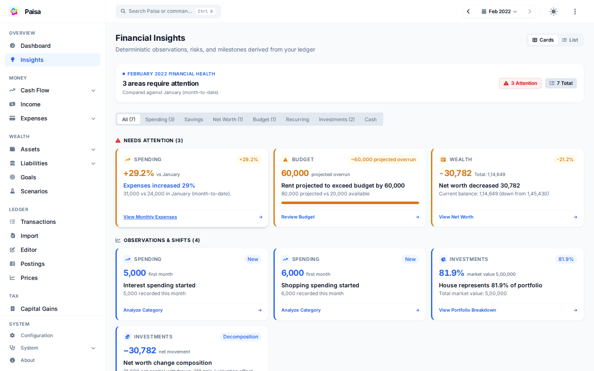

# Financial Insights

Financial Insights compares a selected month with an earlier period and points
out changes worth reviewing. It can highlight spending spikes, budget risk,
changes in savings rate or net worth, recurring-cost changes, cash warnings, and
positive trends.

For example, if groceries usually cost ₹8,000–₹10,000 per month and rise to
₹16,000, Insights may flag the change for you to review. It points out the
change; you decide whether it is expected or needs a correction.

## How to use it

1. Open **Insights** and choose a month.
2. Filter by a category such as Spending, Savings, Budget, Investments, or Cash.
3. Switch between cards and the list view.
4. Open an observation to follow it back to the relevant account or report.

The summary separates **Needs Attention**, **Positive Trends**, and
**Observations & Shifts**. Warnings and critical items are shown with their
severity so you can decide what to review first.

## Data and comparisons

Insights uses the journal data already loaded by Paisa. Comparisons normally use
the previous month or a rolling baseline, depending on the observation. The
current month may be marked as partial when it has not finished; treat those
figures as provisional. A small or incomplete history can also reduce the
confidence of a comparison.

These are deterministic observations from your own data, not recommendations
from an external AI service. Use them as prompts for review rather than as
financial advice.
