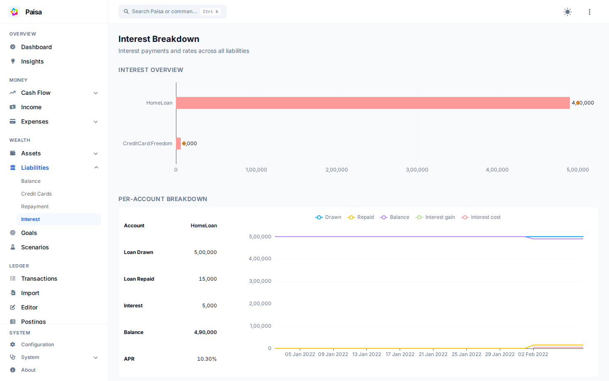

# Liabilities

Paisa separates the main parts of debt tracking so you can see what you owe,
what it costs, and how quickly it is being repaid.



- **Balance** shows outstanding liability balances from your journal.
- **Interest** shows interest paid, loan drawdowns, repayments, balance, and APR
  where that information is available.
- **Repayments** shows the monthly repayment timeline and debt reduction.
- **Credit cards** adds statement dates, due dates, limits, and utilization to a
  liability account.

Paisa reads these values from your journal. It does not connect to lenders or
initiate payments.

## Example loan payment

Separate principal from interest in the journal so Paisa can report each part:

```ledger
2026/09/05 Home loan payment
    Liabilities:HomeLoan       18000 INR
    Expenses:Interest           7000 INR
    Assets:Checking           -25000 INR
```

This payment reduces the loan principal by ₹18,000, records ₹7,000 as interest
expense, and moves ₹25,000 out of checking.

See [Balances](balance.md), [Credit cards](../credit-cards.md),
[Interest](interest.md), and [Repayments](repayment.md) for the individual
views.
