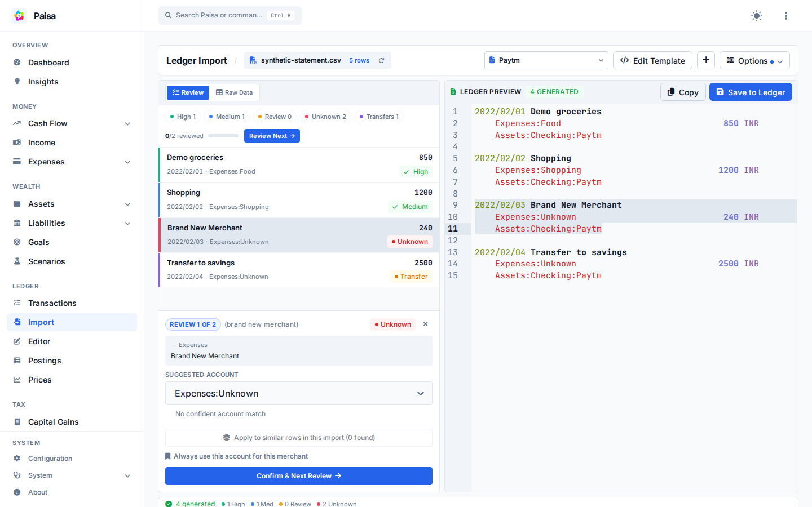

# Account suggestions

When you import a statement, Paisa can suggest an account for each transaction.
Suggestions help with the first pass; you review them in the preview before
anything is added to the journal.



## Example

Suppose a statement contains `SWIGGY INSTAMART BANGALORE` for ₹1,248. A saved
merchant rule or several matching transactions in your journal may produce:

```text
Suggested account: Expenses:Groceries
Confidence: High
Reason: known merchant with matching ledger history
```

An ambiguous description such as `AMAZON` may have been recorded under
`Expenses:Shopping` four times and `Expenses:Books` three times. Paisa marks a
split history like this for review instead of pretending that one answer is
certain.

## How a suggestion is made

Paisa first checks saved merchant rules, then compares the transaction with
your committed ledger history. Historical matches consider the merchant,
source account, direction, currency, amount, and recency. If there is still no
confident match, Paisa can use an older keyword-similarity fallback.

When the evidence is weak, Paisa marks the suggestion for review or returns
`Unknown` instead of treating it as certain.

The result includes a confidence level and a reason where available. Low-
confidence and unknown suggestions should be reviewed or replaced before you
save the import.

## Merchant rules

If a merchant always belongs to the same account, save a merchant rule from the
import workflow or configuration. Rules are stored under
`prediction.merchant_rules` in `paisa.yaml` and take precedence over general
history. Read-only configurations cannot save new rules.

Reviewing or overriding a suggestion fixes the current import. A saved merchant
rule is the option that persists for future imports; Paisa does not silently
change your journal categories.

Prediction runs locally on the data available to Paisa. It does not send your
statement to an external AI service.

### Technical notes

The legacy fallback represents account descriptions with TF-IDF and compares
them using cosine similarity. It can produce **Needs Review** or **Unknown**, but
never a high-confidence suggestion.
