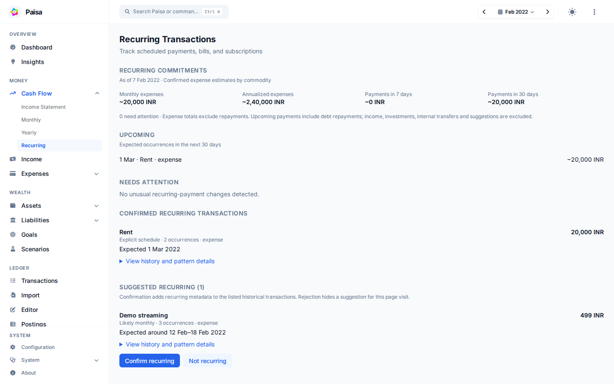

# Recurring transactions

Recurring transactions are regular payments such as rent, subscriptions,
insurance, and loan payments. The Recurring page shows upcoming and recently
missed payments, along with the dates Paisa expects next.



## What you see

Confirmed patterns show recent amounts, the usual amount, expected date
windows, and warnings for late or possibly stopped payments. The dashboard uses
the same analysis for its shorter recurring summary.

## Set a schedule manually

Paisa depends on the posting metadata to identify which transactions are
recurring. Add `Recurring` metadata to payments that belong to the same series.
For example, a journal may contain two monthly rent payments:

```ledger
2023/07/01 Rent
    Expenses:Rent             15,000 INR
    Assets:Checking

2023/08/01 Rent
    Expenses:Rent             15,000 INR
    Assets:Checking
```

You can manually tag a posting by adding `; Recurring: Rent`.

```ledger
2023/07/01 Rent
    ; Recurring: Rent
    Expenses:Rent             15,000 INR
    Assets:Checking

2023/08/01 Rent
    ; Recurring: Rent
    Expenses:Rent             15,000 INR
    Assets:Checking
```

`Recurring` is the tag name. Its value groups related transactions, so use the
same value for every payment in a series.

Tagging every posting can be tiresome. Ledger has a feature called
[Automated Transaction](https://ledger-cli.org/doc/ledger3.html#Automated-Transactions)
which can make this process simpler.

```ledger
= Expenses:Rent
    ; Recurring: Rent
```

The first line is the predicate. Ledger adds the metadata below it to matching
postings. The simple form matches an account name; expressions can also match a
payee, amount, or combination of fields. See Ledger's
[complex expressions](https://ledger-cli.org/doc/ledger3.html#Complex-expressions)
for the complete syntax.

```ledger
= expr payee=~/^PPF$/
    ; Recurring: PPF

= expr payee=~/Mutual Fund/
    ; Recurring: Mutual Fund

= expr 'account=~/Expenses:Insurance/ and (payee=~/HDFC/)'
    ; Recurring: Life Insurance

= expr 'account=~/Expenses:Insurance/ and !(payee=~/HDFC/)'
    ; Recurring: Bike Insurance

= expr payee=~/Savings Interest/
    ; Recurring: Savings Interest
```

!!! tip

    Include the automated transactions at the top of the main ledger
    file. Ledger will apply the rules only to transactions that
    follow the automated transactions.

## Period syntax

Paisa tries to infer the interval from transaction history. When that interval
is unusual or the history is still short, specify it with `Period` metadata.

```ledger
= expr payee=~/Savings Interest/
    ; Recurring: Savings Interest
    ; Period: L MAR,JUN,SEP,DEC ?
```

The example describes interest paid on the last day of each quarter. The editor
validates period syntax and shows the next three dates beside the metadata.

```
┌─────────── day of the month 1-31
│  ┌─────────── month 1-12 or JAN-DEC
│  │  ┌─────────── day of the week 0-6 (Sunday to Saturday)
│  │  │
1  *  ?
```

The syntax of the period is similar to
[cron](https://en.wikipedia.org/wiki/Cron), with the omission of seconds and
hours.

| Field        | Allowed values      | Special characters |
| ------------ | ------------------- | ------------------ |
| Day of month | `1–31`              | `* , - ? L W`      |
| Month        | `1-12` or `JAN-DEC` | `* , -`            |
| Day of week  | `0-6` or `SUN-SAT`  | `* , - ? L`        |

`*` matches every valid value. `?` leaves either day-of-month or day-of-week
unspecified. `L` means the last day of the month or week, `,` lists values, `-`
defines a range, and `W` means the nearest business day to a day of the month.

Join multiple expressions with `|`. See the
[cron overview](https://en.wikipedia.org/wiki/Cron) for background. The editor
shows whether an expression is valid and previews its next three dates.

### Examples

- Last day of every month `#!ledger ; Period: L * ?`
- 5<sup>th</sup> every month `#!ledger ; Period: 5 * ?`
- Every Sunday `#!ledger ; Period: ? * 0`
- 1<sup>st</sup> of Jan and 7<sup>th</sup> of Feb
  `#!ledger ; Period: 1 JAN ? | 7 FEB ?`
- Closest business day to the 15<sup>th</sup> day of every month.
  `#!ledger ; Period: 15W * ?`

!!! warning

    The Recurring page needs at least two transactions with the same recurring
    tag value. A series with only one recorded transaction does not appear yet.

## Let Paisa suggest recurring transactions

The recurring page also reviews untagged history for deterministic patterns.
Suggestions require at least three compatible occurrences. Paisa compares the
merchant, account, direction, commodity, and timing while allowing for small
posting delays and month-end dates. Suggestions do not affect confirmed expense
totals.

## Confirm a suggestion

**Confirm recurring** adds `Recurring` metadata (or Beancount `recurring`
metadata) to the displayed historical transactions. Paisa preserves the
remaining source text, validates the edited files, creates its usual backups,
saves, and synchronizes. If a file changed while you were reviewing it, reload
the page before confirming.

Continue applying the same recurring tag to future transactions, manually or
with an existing ledger automation rule. Confirmation does not create an
automatic merchant rule or change transaction categories.

**Not recurring** hides the suggestion for the current page visit. Reloading or
reopening the page may show it again; durable rejection rules are not stored.

## How estimates are calculated

Confirmed patterns show historical and typical amounts, expected date windows,
amount changes, and conservative late or possibly-stopped indicators. An
explicit `Period` remains authoritative. A manually tagged transaction remains
confirmed even when there is not enough evidence to predict its next occurrence.

Monthly and annual estimates include confirmed expenses only. Income, transfers,
investments, unconfirmed suggestions, and possibly-stopped sequences do not
inflate these commitments. Commodities are reported separately. Uncertain timing
is excluded from annualized estimates and identified in the summary.

The Recurring page also keeps its calendar and scheduled-history view in an
expandable section.

Monthly and annual figures measure expenses. Upcoming payment totals and the
dashboard cash forecast include full cash obligations, including loan principal
and card repayments. For example, a 10,000 loan payment with 2,000 interest adds
2,000 to expense estimates and 10,000 to upcoming payments. Income, investments,
and internal transfers are excluded from those payment totals.

Amount-change alerts require both a 10% change and a commodity-specific floor:
INR 10, USD/EUR/GBP 1, or JPY 100. Other currencies use one minor unit; other
commodities use 0.01. All displayed amounts respect the shared locale, precision,
and obscure-mode settings. Explicit periods display as “Explicit schedule” and
do not produce inferred cadence-change alerts. “New” alone does not require
attention.

Suggestions render 25 at a time; use **Show more suggestions** to see more.

### Technical notes

When confirmation affects multiple files, Paisa validates every source before
writing and synchronizes once. A write or synchronization failure restores the
batch from backups. If restoration also fails, the error lists the recovery
files to restore before retrying. This protects against ordinary failures, but
is not a crash-atomic filesystem transaction.
